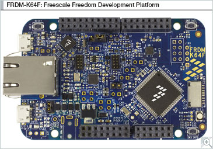

# frdm-k64f-projects

this repo contains my personal projects using FRDM-K64F board.

## common build instructions
All my projects are based on GNU GCC and command line interface. I just don't like working with IDEs.
Whether you like it or not, Kinetis SDK is using CMake based Makefile generation. Although I am not a huge fan of CMake, all the samples are based on CMake. I'm just too lazy to come out with my own Makefile. Maybe sometime later when I get enough time to work on it.

Anyway original CMakeLists.txt is modified so that all you gotta do to build is change the SdkRoot CMake variable in CMakeLists.txt and path in build_xxx.sh.

Usually you gotta follow this sequence
1. clone this repo
2. of course, set ARMGCC_DIR env variable properly as required by Kinetis SDK
3. modify SdkRoot in armgcc/CMakeLists.txt
4. modify armgcc.cmake pathin build_debug.sh (or build_release.sh)
5. happy making!

## Flashing & Debugging
As of this writing, it looks like FRD-K64F is not well supported by OpenOCD. So I guess it's best and more convenient to go with Segger OpenSDA and JLink. Just download Segger OpenSDA V2.0 from [segger web site](https://www.segger.com/downloads/jlink/#JLinkOpenSDABoardSpecificFirmwares). Be sure to download Board-Specific Firmware.

With Segger OpenSDA, flashing is just a matter of drag & drop. If it doesn't work, you might have installed a generic firmware.

To debug,

1. JLinkGDBServer -device MK64FN1M0xxx12 -if SWD
2. arm-none-eabi-gdb -ex 'target remote:2331' your.elf
3. monitor reset
4. monitor halt
5. load
6. cont
7. happy debugging & flashing

# Brief Introduction on projects
1. blinky
this is a bare-metal version of typical blinky. Quite surprising Kinetis SDK doesn't come with any sort of delay library.
